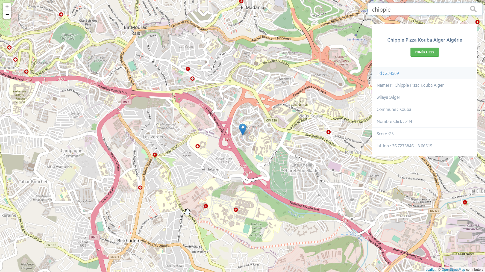

<p align="center"></p>

<p align="center">
<a href="https://packagist.org/packages/laravel/framework">1.0.0</a>
<a href="https://packagist.org/packages/laravel/framework"></a>
</p>
Real-time Search Engine with Node.js, react.js and Elasticsearch

## Getting Started
- Clone this repo 
```
git clone https://github.com/YAtechnologies/yamaps_front_demo.git

```


- change directory into the newly cloned repo
```
cd yamaps_front_demo
```

- Install required node.js libraries in the root foolder
```
yarn install
```

### build 

```

docker build --build-arg REACT_APP_BACKEND_HOST=staging --build-arg REACT_APP_BACKEND_PORT=80 -t yamaps_front_demo:latest .

```

### run docker

```
docker run  -p 80:80   -it  yamaps_front_demo:latest
```

