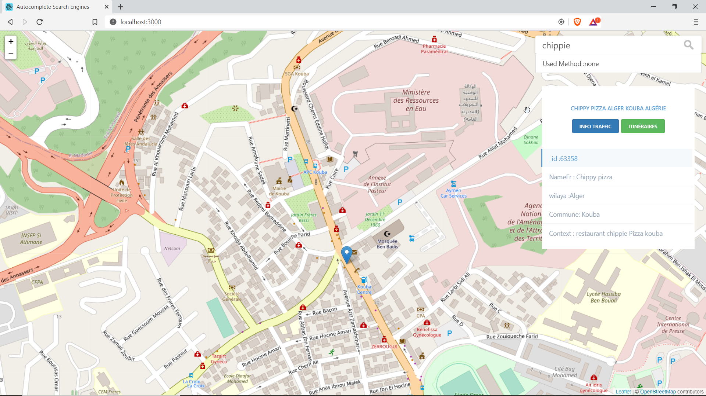

<p align="center"></p>

<p align="center">
Real-time Search Engine with <a href="https://nodejs.org/en/">NodeJS</a>, <a href="https://fr.reactjs.org/">ReactJS</a>
 and <a href="https://www.elastic.co/fr/">Elasticsearch</a>

</p>

## Getting Started
- Clone this repo 
```
git clone https://github.com/YAtechnologies/yamaps_front_demo.git

```


- change directory into the newly cloned repo
```
cd yamaps_front_demo
```

- Install required node.js libraries in the root foolder
```
yarn install
```

### build 

```

docker build --build-arg REACT_APP_BACKEND_HOST=staging --build-arg REACT_APP_BACKEND_PORT=80 -t yamaps_front_demo:latest .

```

### run docker

```
docker run  -p 80:80   -it  yamaps_front_demo:latest
```

